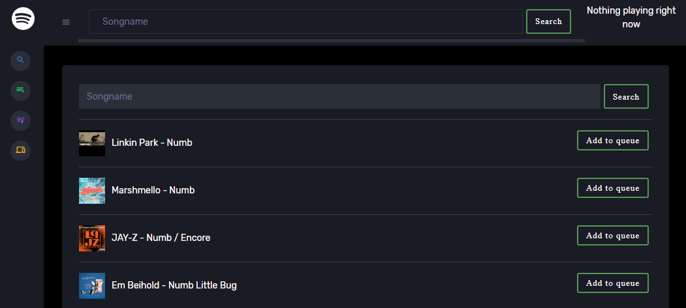

# spotify-party-queue
I was tired of saying "please make sure to not click on a song" when i was giving away my phone so someone else could add his favorite songs to the playback queue and then still fucking up the playback, so i decided to write a web interface (e.g. for the use on a tablet) for spotify that only allows **adding** songs to the playback queue.

# Features
- Add songs to queue (only works if spotify is actively playing)
- List saved songs
- List playlists (own + followed ones)
     - And all songs of a specific playlist
- Transfer playback to another active device
- Ability to (un)hide specific playlists permanently (/hideplaylists)

# Prerequisites
- Python3 
     - `sudo apt install python3 python3-pip`
- flask and configparser 
     - `pip3 install flask ConfigParser`

# Install
1. Create a spotify application in the spotify [developer dashboard](https://developer.spotify.com/dashboard/applications)
2. Clone this repo
`git clone https://github.com/Brephlas/spotify-party-queue.git`
3. Create file `config.ini` with your spotify client id and secret:
```
[Spotify]
client_id = CLIENT_ID
client_secret = CLIENT_SECRET

[Network]
redirect_uri = REDIRECT_URI
port = PORT
```
4. Change the port to your preferred one in the file `.flaskenv`. I'm using port 5000
5. Run app with `flask run` or gunicorn `gunicorn --bind=0.0.0.0:<PORT> spotify:app` (`pip install gunicorn`)
6. Open `http://<SERVERIP>:<PORT>` in your browser
7. Authorize the app to access your spotify data
8. Enjoy - Hopefully!

# Screenshots

## Search


## List playlists


## List songs of playlist

